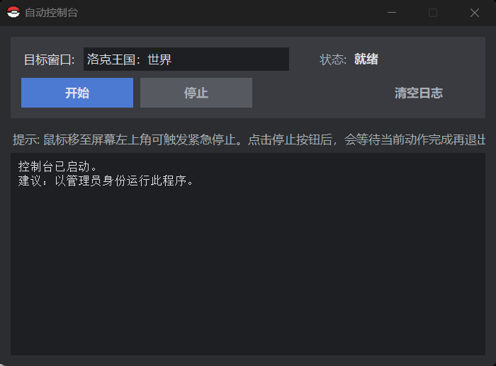

# 🎮 RocoAutoCoin GUI

## 🖼️ 界面预览

  

---

## ✨ 使用说明

- 队伍放置 **1~4号宠物**
- **每只宠物第一个技能只需带「彗星」技能即可**
- 打开游戏并进入对应界面
- 启动程序后点击「开始」运行
- 点击「停止」结束

---

## ⬇️ 下载

- [Download RocoAutoCoin](https://github.com/ELMA0158/Farm-coins-in-Rock-Kingdom/releases/tag/RocoAutoCoin)

---

## 📌 致谢

- [Rocokingdom-AutoCoin](https://github.com/wuyan124/Rocokingdom-AutoCoin)